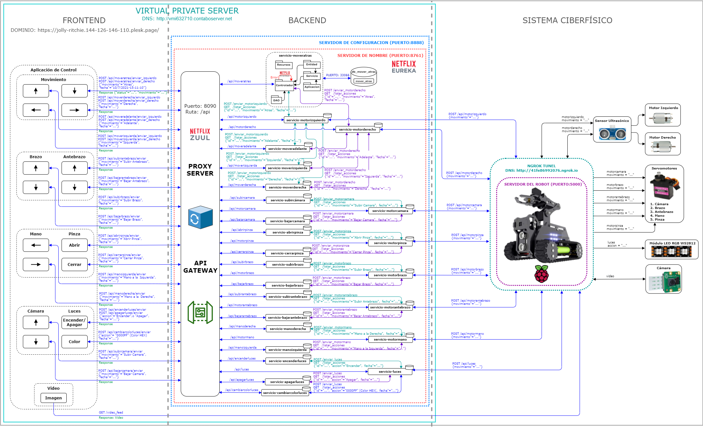

# Degree-Project
Design and implementation of an architecture for the telematic control of cyber-physical systems based on microservices and fault-tolerant.

This repository presents my degree work, which consists of a microservices architecture oriented to the telematic control of a robot that can be managed through a user interface developed in HTML. 

This architecture consists of three main layers, the first is the frontend, a control
application developed in HTML, CSS and JavaScript that can be used on any device,
the second is the backend, a microservices oriented and fault tolerant architecture
developed with JAVA, Spring, Netflix libraries and occupying SQL databases, and the
third and final layer is a cyber physical system (CPS) and more precisely a robot that
has a Raspberry Pi as controller, where a server developed in Python and Flask is
deployed. The deployment to meet the telematic control is done on the Internet with the
help of a VPS.

The control application can be seen in the following figure:

And the fully deployed architecture can be seen in the following figure:

